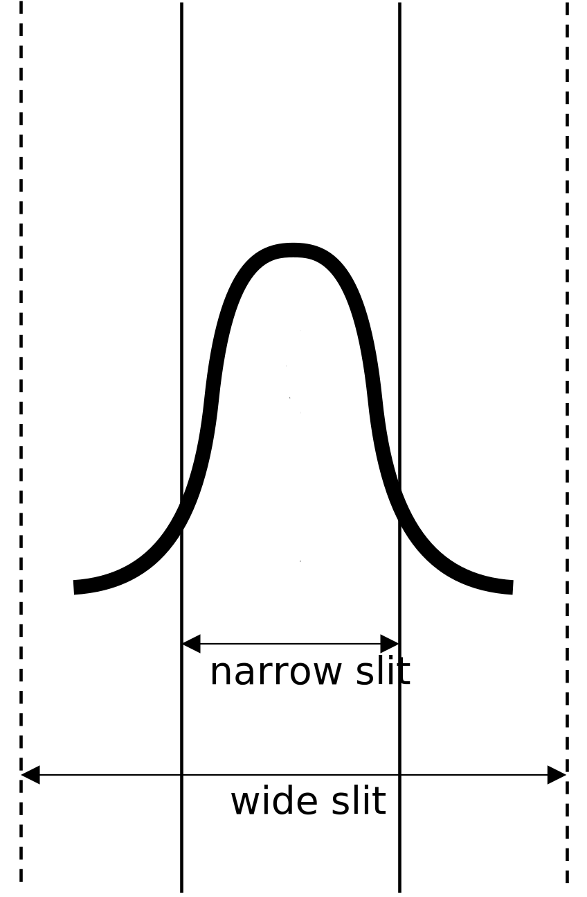
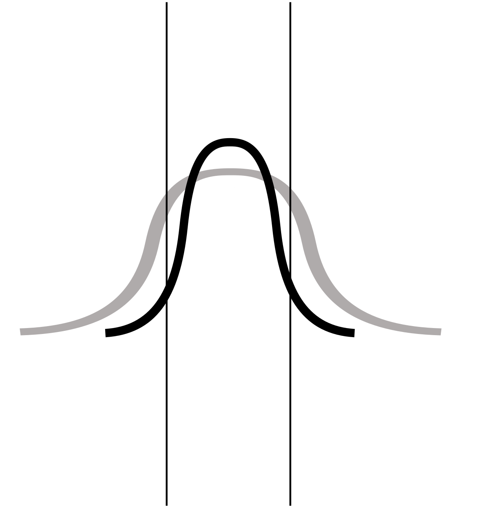
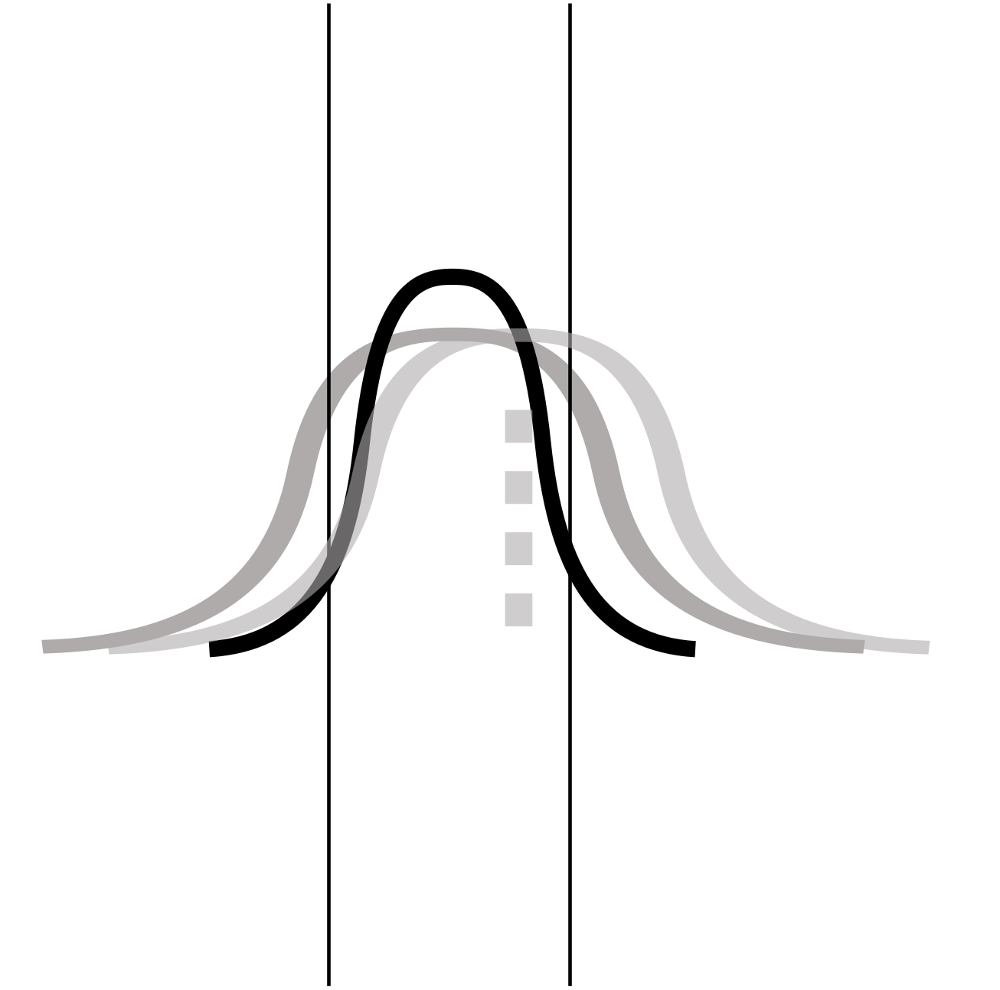

Light illumating on a slit will naturally have some loss. Suppose the PSF is Gaussian, the slit transmission can be written as:

$$
\text{slit transmission} = {\rm erf}\left(\frac{\text{slit width}/2}{\sqrt{2}\times\sigma}\right)
$$

The slit loss is then:

$$
\text{slit loss} = 1 - \text{slit transmission}
$$

For Gaussian PSF:

$$
\sigma = \frac{\text{FWHM}}{2.355}
$$

and the FWHM of the image is composed of:

$$
\text{FWHM}^2 = \text{FWHM}_{\rm atm}^2(s,x,\lambda)+\text{FWHM}_{\rm tel}^2(D,\lambda)+\text{FWHM}_{\rm ins}^2(\lambda)
$$

where $s$ is seeing, $x$ is airmass, $D$ is telescope diameter and $\lambda$ is wavelength.

In the limit where the standard star observations and science observations have exactly the same seeing, the flux calibration will be nearly perfect (consider the major difference is coming from seeing). In the more realistic scenario where they differ, this will manifest as a wavelength-dependent systematic error in the flux calibration, with the direction of the error depending on the relative seeing between the standard-star and science observations.

When doing quasar simulation, we have a `sobjs_fake.FWHMFIT`. We can use it to calculate a slit transmission function varied with wavelength. The assumption here is that the point source is on the center of the slit for all wavelengths, which might not be the case since there is atmospheric diffraction. It's hard to get it corrected from first principle. Alternatively, We can use a wider slit observation to estimate this. Slit transmission for all wavelength with a wide enough slit would be $1$. 

